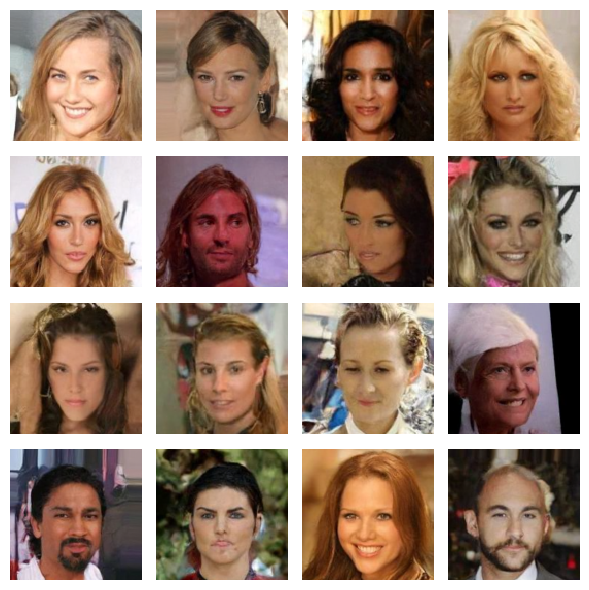
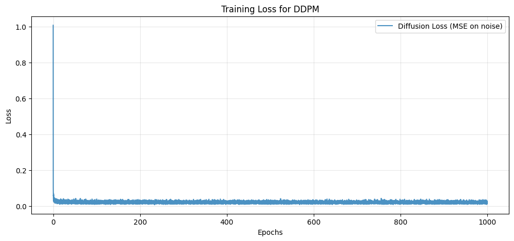
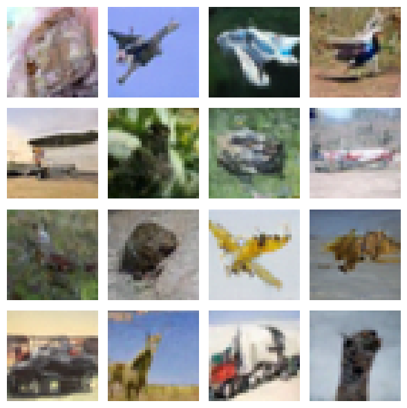
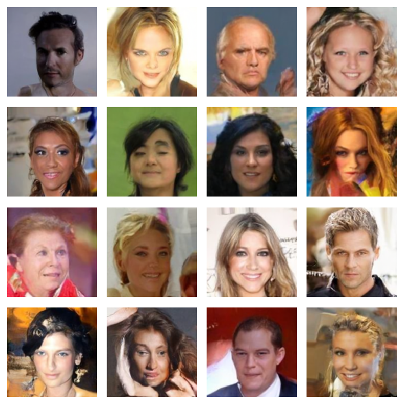

# Diffusion Models

Denoising diffusion probabilistic models implemented from scratch in PyTorch —
UNet, attention, time embeddings, noise schedule and sampling loop all written
from the papers rather than pulled from a library.

Trained on CIFAR-10 (32×32) and CelebA (128×128).

  
   
  Unconditional samples, CelebA 128×128, EMA weights, Using DDPM sampler

### Training loss

  
   
  MSE on predicted noise for DDPM trained on CELEB A 128x128

---

## What's implemented

Everything below is written directly in this repo:

- **UNet backbone** — downsampling and upsampling residual blocks with skip
  connections, each conditioned on the timestep.
- **Sinusoidal time embeddings** — integer timesteps projected into a
  continuous embedding and injected into every block.
- **Multi-head self-attention** — attention blocks at the lower-resolution
  stages, with the QKV projection and scaled dot-product written out.
- **Cosine noise schedule** — the ᾱ schedule from Nichol & Dhariwal (2021),
  `s = 0.008`, with per-step betas clipped at 0.999 for numerical stability.
- **ε-prediction training objective** — sample `t ~ U(1, T)`, corrupt the
  image with the closed-form forward process, and regress the noise under MSE.
- **EMA of weights** — exponential moving average at decay 0.9999, kept
  separately from the training weights and used for all sampling.
- **DDPM & DDIM sampling** 

**Future:** `LatentDiffusionModel.py` extends this with an
encoder/decoder pair and cross-attention over a context vector, moving toward
latent and conditional diffusion.

---

## Results

### Sample quality

| Dataset | Resolution | Steps | Sampler |FID ↓ | Samples used | 
|---|---|---|---|---|---|
| CelebA | 128×128 | 512 | DDIM@ 100 Steps |**[17.8]** | [10,0000] |
| CelebA | 128×128 | 512 | DDIM@ 50 Steps |**[18.6]** | [10,0000] |

FID was Computed using Clean-fid Library in FID.py

---

## Configuration

Two configurations, one per dataset.

| | CIFAR-10 | CelebA |
|---|---|---|
| Image size | 32×32 | 128×128 |
| Diffusion steps `T` | 1024 | 512 |
| Model width | 128 | 128 |
| UNet stages | 1 | 3 |
| Attention heads | 8 | 8 |
| Time embedding dim | 64 | 64 |
| Batch size | 128 | 64 |
| Optimiser | Adam, β = (0.9, 0.999) | Adam (fused), β = (0.9, 0.999) |
| Learning rate | 2e-4 | 2e-4 |
| EMA decay | 0.9999 | 0.9999 |
| Epochs | [actual] | [actual] |
| Mixed precision | FP16 AMP (GradScaler) | FP16 AMP (GradScaler) |
| Hardware | [1X RTX A2000 12GB] | [1X RTX A2000 12GB] |

---
## Notes
- DDIM sampler is referred to as sample_() and DDPM sampler is referred to as sample().
- Diffusion Model was optimised for RTX A2000 GPU to increase CUDA throughput(~4s to ~2.5s) and Memory Usage.
- **Trained Weights Not Included as File Sizes are large for Github.CelebA 128x128 weights and checkpoints can be requested**

### Generated samples

  
   
  CIFAR-10, 32×32

  
   
  CelebA, 128x128 DDIM 100 Steps

## References

- Ho et al. (2020), *Denoising Diffusion Probabilistic Models* — [arXiv:2006.11239](https://arxiv.org/abs/2006.11239)
- Nichol & Dhariwal (2021), *Improved Denoising Diffusion Probabilistic Models* — [arXiv:2102.09672](https://arxiv.org/abs/2102.09672)
